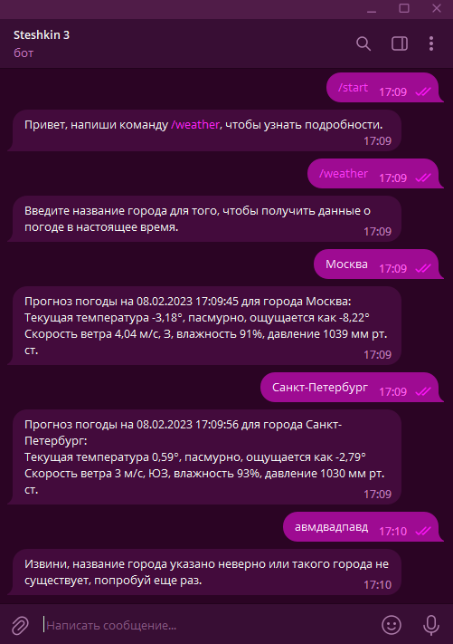

# Интеграция с телеграмом
__Задание__
---
US: пользователь спрашивает у телеграм-бота погоду в нужном ему городе. Бот отвечает информацией: город, температура. влажность, скорость ветра, направление и давление
- Показать следующие параметры:
- Текущая температура;
- Описание (Ясно, пасмурно и т.д.);
- Ощущается как;
- Скорость ветра, направление;
- Влажность;
- Давление рт.ст.

---
## Результат:

---
___Работу выполнил студент группы ИП - 19 - 3 Стешкин Георгий___